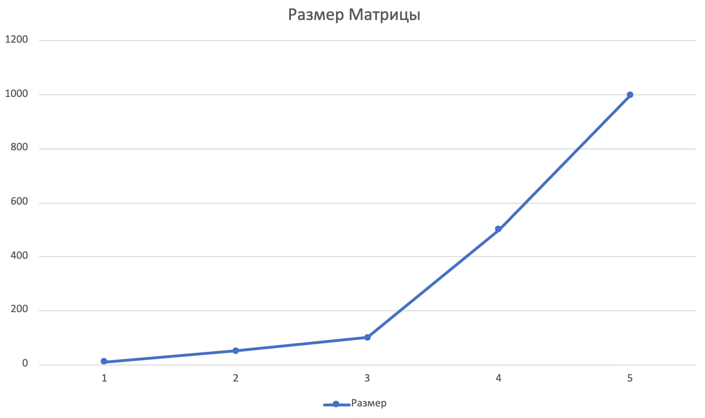
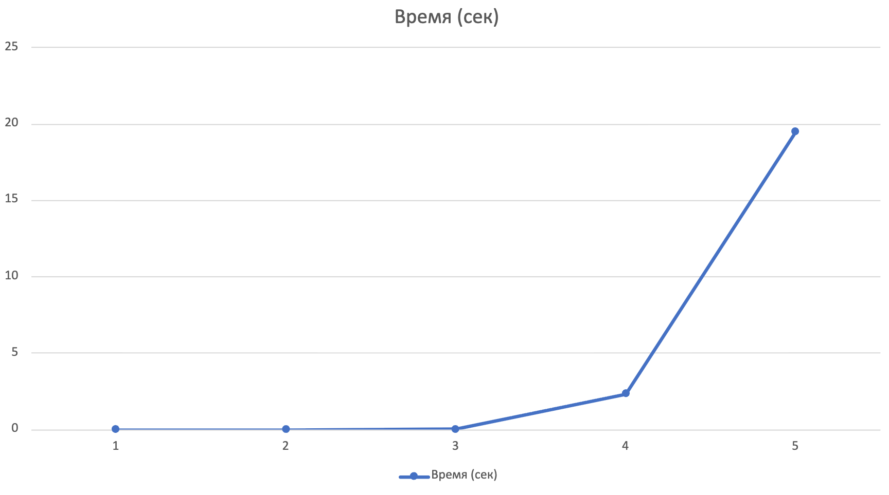

## _Лабораторная №1_

### **Задание**

**_Написать программу на языке C/C++ для перемножения двух квадратных матриц._**

### **Структура проекта**

  `parallel-programming/`  
  `├── src/             `  
  `│   ├── main.cpp     `   _# Исходный код программы на C++_  
  `│   └── matrix       `   _# Скомпилированный исполняемый файл_  
  `├── data/            `  
  `│   ├── matrixA.txt  `   _# Входная матрица A_  
  `│   ├── matrixB.txt  `   _# Входная матрица B_  
  `│   └── matrixC.txt  `   _# Результирующая матрица C = A × B_  
  `├── generate.py      `   _# Скрипт генерации тестовых матриц_  
  `├── verify.py        `   _# Скрипт автоматизированной верификации_  
  `├── benchmarks.py    `   _# Скрипт серии экспериментов_  
  `├── stats.csv        `   _# Результаты экспериментов_  
  `└── README.md        `   _# Думаю понятно :)_   

### **Описание файлов**

`src/main.cpp` - Исходный код программы умножения матриц на C++  
`src/matrix` - Скомпилированный исполняемый файл (Linux)  
`data/matrixA.txt` - Входная матрица A (формат: первая строка — размер N, далее N строк данных)  
`data/matrixB.txt` - Входная матрица B (аналогичный формат)  
`generate.py` - Генерация случайных матриц заданного размера  
`verify.py` - Проверка результата через NumPy (сравнение с эталоном)  
`benchmarks.py` - Автоматизация серии экспериментов для разных N и запись в stats файл  
`stats.csv` - Таблица результатов (размер, время, операции, статус)  

### **Как запустить**

#### Автоматическое выполнение (генерация матриц, проведение сравнения, запись результатов в файл)

`python3 benchmarks.py`

---

Если нет исполняемого файла: (из кореневого каталога репозитория): `g++ src/main.cpp -o src/matrix` 

### **Результаты тестов**

| Размер | Время (сек) | Операций | Статус |
|--------|-------------|----------|--------|
| 10 | 0.0 | 1 000 | ✅ PASSED |
| 50 | 0.0014159 | 125000 | ✅ PASSED |
| 100 | 0.012624 | 1 000 000 | ✅ PASSED |
| 500 | 2.3424 | 125 000 000 | ✅ PASSED |
| 1000 | 19.524 | 1 000 000 000 | ✅ PASSED |

### **Результаты тестов**

_График размера матриц:_

_График времени вычисления:_

### **ВЫВОД**

В ходе выполнения первой лабораторной работы была разработана программа для последовательного умножения квадратных матриц на языке C++ с использованием стандартной библиотеки STL (std::vector). Реализован классический алгоритм умножения матриц с теоретической сложностью O(N³), организовано чтение входных данных из файлов и запись результатов, а также выполнен точный замер времени вычислений с помощью библиотеки std::chrono.

В результате экспериментального исследования подтверждена теоретическая зависимость времени выполнения от объёма задачи. Для матрицы размером 1000×1000 время вычислений составило 19.524 секунды при выполнении 1 миллиарда операций, что соответствует ожидаемой производительности последовательного алгоритма. Все тесты пройдены успешно (статус PASSED), расхождения с эталонными значениями NumPy не превышают машинной погрешности.
