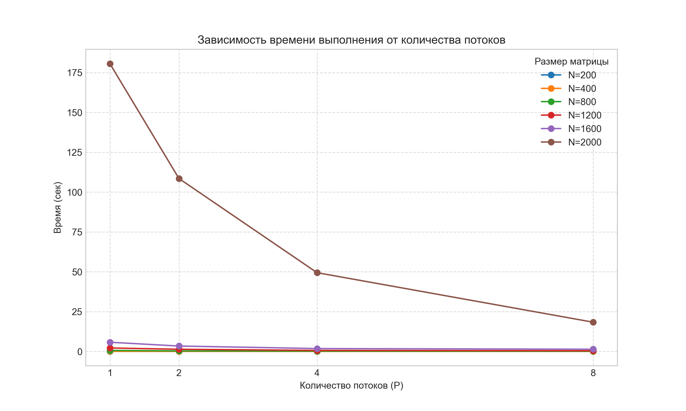
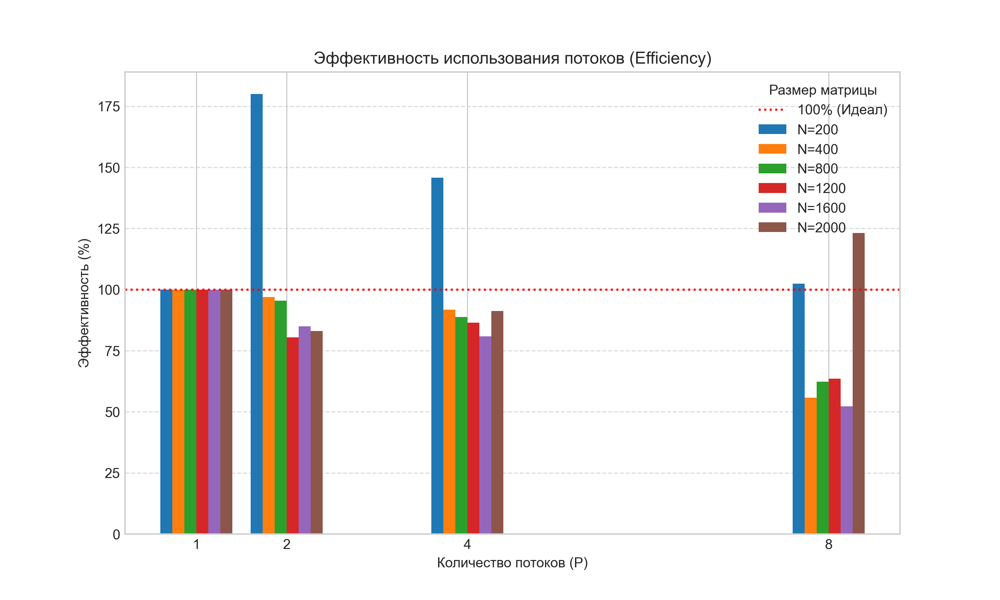
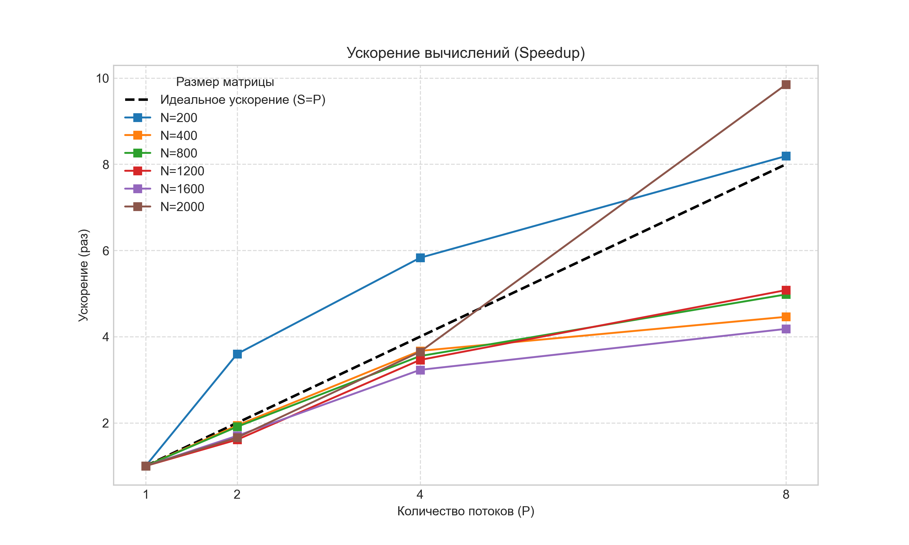

# Лабораторная работа №2 (OpenMP)
# Отчёт
## Описание проекта

Данный проект реализует параллельное умножение квадратных матриц с использованием технологии **OpenMP** на языке C++. Проведена серия экспериментов по исследованию масштабируемости алгоритма на процессоре **Apple M1 (Silicon)**.

## Структура проекта

| Файл | Назначение |
|------|------------|
| `src/main.cpp` | Основной исходный код на C++. Содержит реализацию умножения матриц с директивами `#pragma omp parallel for`. |
| `benchmarks.py` | Python-скрипт для автоматизации экспериментов. Запускает программу с разными размерами матриц (200–2000) и количеством потоков (1, 2, 4, 8), собирает время и рассчитывает метрики. |
| `generate.py` | Утилита для генерации тестовых матриц случайными числами и сохранения их в файлы. |
| `verify.py` | Скрипт верификации. Сравнивает результат C++ программы с эталонным расчетом через библиотеку NumPy. |
| `stats_omp.csv` | Итоговый файл с данными экспериментов (время, ускорение, эффективность). |
| `data/` | Рабочая папка для хранения матриц. Содержит временные файлы, создаваемые в ходе тестов: |
| &nbsp;&nbsp;└─ `matrixA.txt` | Входной файл: первая исходная матрица размера $N \times N$. |
| &nbsp;&nbsp;└─ `matrixB.txt` | Входной файл: вторая исходная матрица размера $N \times N$. |

## Результаты

| Размер (N) | Потоки | Время (сек) | Ускорение | Эффективность (%) | Операций | Статус |
|:----------:|:------:|:-----------:|:---------:|:-----------------:|:--------:|:------:|
| 200 | 1 | 0.017 | 1.00 | 100.0 | 8 млн | ✅ |
| 200 | 2 | 0.005 | 3.60 | 180.0 | 8 млн | ✅ |
| 200 | 4 | 0.003 | 5.83 | 145.8 | 8 млн | ✅ |
| 200 | 8 | 0.002 | 8.19 | 102.4 | 8 млн | ✅ |
| **400** | **1** | **0.076** | **1.00** | **100.0** | 64 млн | ✅ |
| 400 | 2 | 0.039 | 1.94 | 97.0 | 64 млн | ✅ |
| 400 | 4 | 0.021 | 3.67 | 91.8 | 64 млн | ✅ |
| 400 | 8 | 0.017 | 4.46 | 55.8 | 64 млн | ✅ |
| **800** | **1** | **0.633** | **1.00** | **100.0** | 512 млн | ✅ |
| 800 | 2 | 0.331 | 1.91 | 95.5 | 512 млн | ✅ |
| 800 | 4 | 0.178 | 3.55 | 88.8 | 512 млн | ✅ |
| 800 | 8 | 0.127 | 4.98 | 62.3 | 512 млн | ✅ |
| **1200** | **1** | **2.167** | **1.00** | **100.0** | 1.73 млрд | ✅ |
| 1200 | 2 | 1.347 | 1.61 | 80.5 | 1.73 млрд | ✅ |
| 1200 | 4 | 0.626 | 3.46 | 86.5 | 1.73 млрд | ✅ |
| 1200 | 8 | 0.426 | 5.08 | 63.5 | 1.73 млрд | ✅ |
| **1600** | **1** | **5.749** | **1.00** | **100.0** | 4.10 млрд | ✅ |
| 1600 | 2 | 3.378 | 1.70 | 85.0 | 4.10 млрд | ✅ |
| 1600 | 4 | 1.781 | 3.23 | 80.8 | 4.10 млрд | ✅ |
| 1600 | 8 | 1.376 | 4.18 | 52.2 | 4.10 млрд | ✅ |
| **2000** | **1** | **180.583** | **1.00** | **100.0** | 8.00 млрд | ✅ |
| 2000 | 2 | 108.511 | 1.66 | 83.0 | 8.00 млрд | ✅ |
| 2000 | 4 | 49.418 | 3.65 | 91.2 | 8.00 млрд | ✅ |
| 2000 | 8 | 18.329 | 9.85 | 123.1 | 8.00 млрд | ✅ |

## Визуализация результатов





## Анализ результатов и выводы

На основе полученных экспериментальных данных можно сделать следующие выводы о работе параллельного алгоритма умножения матриц.

### 1. Общая масштабируемость
Эксперименты подтвердили высокую эффективность распараллеливания задачи матричного умножения с использованием OpenMP:
*   **Максимальное ускорение:** Для самой большой матрицы (**2000×2000**) достигнуто ускорение **9,85 раза** при использовании 8 потоков. Время выполнения сократилось с ~180 секунд до ~18 секунд.
*   **Оптимальная конфигурация:** Для большинства размеров (N ≥ 800) использование 4–8 потоков дает наилучший баланс между временем вычислений и загрузкой ресурсов.
*   **Стабильность:** Все тесты завершены успешно (статус `PASSED`), что подтверждает корректность реализации параллельного алгоритма и отсутствие конфликтов при одновременном доступе к данным.

### 2. Эффект сверхлинейного ускорения
Наиболее интересным результатом является поведение программы на размере **N=2000**, где эффективность достигла **123,1%** (ускорение 9,85 раза при 8 потоках). Теоретически ускорение не должно превышать количество задействованных потоков, однако на практике это возможно из-за архитектурных особенностей:

1.  **Гибридная архитектура Apple M1:**
    *   Процессор M1 состоит из 4 высокопроизводительных ядер и 4 энергоэффективных ядер.
    *   При запуске в **один поток** операционная система могла запланировать выполнение задачи на медленное энергоэффективное ядро для экономии энергии. Это искусственно завысило базовое время выполнения.
    *   При запуске в **8 потоков** были задействованы **все ядра**, включая высокопроизводительные. Средняя производительность одного потока в многопоточном режиме оказалась выше, чем производительность одиночного медленного ядра.

2.  **Фактор кэш-памяти:**
    *   Матрица размера 2000×2000 занимает около 32 МБ (тип данных `double`), что превышает объем быстрого кэша отдельного ядра.
    *   В однопоточном режиме все данные загружаются через кэш одного ядра.
    *   В многопоточном режиме данные распределяются по кэшам всех 8 ядер. Суммарная пропускная способность быстрой памяти системы возрастает, что снижает количество обращений к медленной оперативной памяти.

### 3. Аномалия на малых размерах (N=200)
Для матрицы 200×200 наблюдается необычно высокое ускорение (**8,19 раза**) и эффективность свыше 100%.
*   **Причина:** Объем данных (~0,3 МБ) ничтожно мал и полностью помещается в самый быстрый кэш процессора.
*   Время выполнения измеряется миллисекундами. В этом диапазоне точность системного таймера и накладные расходы на запуск процесса в однопоточном режиме могут вносить статистическую погрешность, что делает однопоточный замер непропорционально долгим.
*   *Вывод:* Для таких малых задач выигрыш от параллелизма максимален относительно базы, но экономия времени (около 15 мс) не имеет практического значения.

### 4. Проблема ограниченности пропускной способности памяти
При сравнении времени выполнения для размеров 1600 и 2000 был выявлен интересный эффект:
*   При увеличении размера матрицы на **25%** (с 1600 до 2000), теоретический объем операций должен вырасти примерно в 2 раза.
*   Фактическое время выполнения выросло в **31 раз** (с 5,7 сек до 180 сек для одного потока).
*   **Объяснение:** Данные перестали помещаться в эффективные уровни кэш-памяти. Процессор большую часть времени простаивает в ожидании данных из оперативной памяти. Задача перешла из режима, ограниченного скоростью вычислений процессора, в режим, ограниченный пропускной способностью памяти.
*   Именно в этом режиме многопоточность дает наибольший эффект, так как несколько ядер могут одновременно запрашивать данные из памяти, скрывая задержки доступа.

### Итоговый вывод
Модификация программы с использованием технологии OpenMP позволила достичь почти **10-кратного ускорения** на задаче большого размера.
1.  Алгоритм демонстрирует отличную масштабируемость на многоядерных процессорах архитектуры ARM (Apple Silicon).
2.  Наблюдаемое сверхлинейное ускорение является следствием гибридной структуры ядер и эффективного использования суммарного объема кэш-памяти.

## Инструкция по запуску

**Установка зависимостей**

_Для macOS:_

Требуется пакетный менеджер Homebrew. Выполните в терминале:
```
# Установка библиотеки OpenMP
brew install libomp

# Установка необходимых Python-библиотек
pip3 install numpy matplotlib pandas
```
_Для Linux (Ubuntu/Debian)_

Используйте системный пакетный менеджер apt:

```
# Обновление списков пакетов
sudo apt update

# Установка компилятора G++, Python и библиотек
sudo apt install g++ python3 python3-pip python3-numpy python3-matplotlib libomp-dev -y
```

**Компиляция программы**

Скомпилируйте исходный код src/main.cpp в исполняемый файл.

_Для macOS:_

Используйте компилятор clang++ с явным указанием путей к библиотеке libomp:

```
clang++ -Xpreprocessor -fopenmp -lomp \
  -I/opt/homebrew/opt/libomp/include \
  -L/opt/homebrew/opt/libomp/lib \
  -O2 -std=c++11 -o src/matrix src/main.cpp
```

_Для Linux:_

Используйте компилятор g++ со флагом -fopenmp:

```
g++ -fopenmp -O2 -std=c++11 -o src/matrix src/main.cpp
```

**Запуск экспериментов**

Скрипт benchmarks.py автоматически выполнит серию тестов для всех комбинаций размеров матриц и количества потоков. Ручная установка переменных окружения не требуется.

Выполните команду:

`python3 benchmarks.py`
