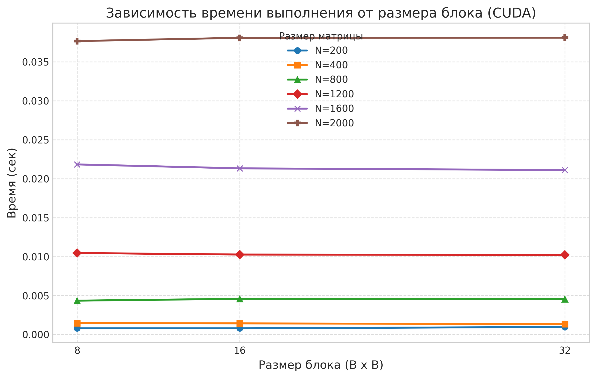
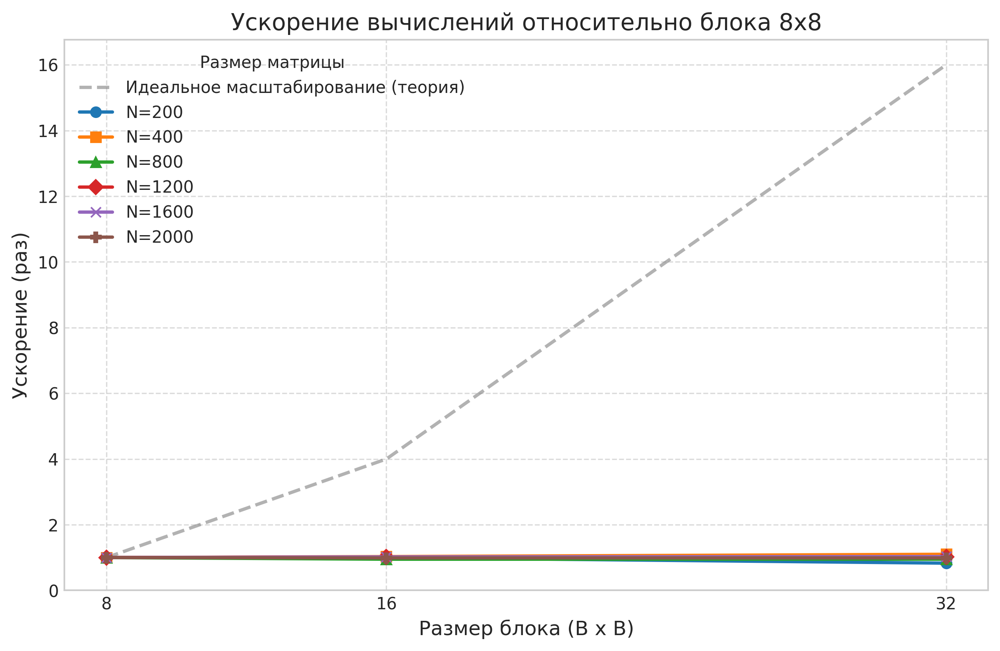
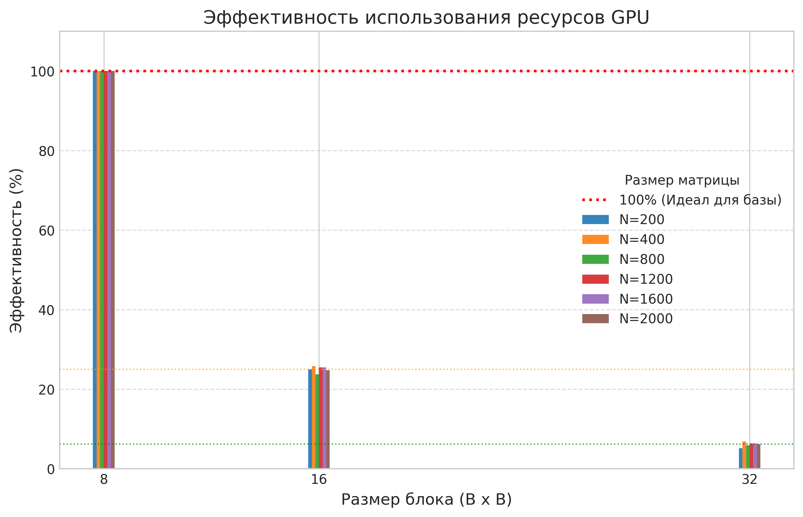

# Лабораторная работа №4: Параллельное умножение матриц (CUDA)

## Описание проекта
В данной лабораторной реализуется параллельное умножение квадратных матриц с использованием технологии **CUDA (Compute Unified Device Architecture)** на языке C++.

Вычисления выполнялись на графическом процессоре **NVIDIA GeForce RTX 5070**, что позволило оценить эффективность современных GPU для задач массовой параллельной обработки данных.

В отличие от лабораторных работ №2 (OpenMP) и №3 (MPI), где вычисления производились на центральном процессоре (CPU), в данной работе основная нагрузка переносится на видеокарту, которая обладает тысячами вычислительных ядер.

### Структура файлов и назначение

| Файл / Папка | Назначение |
| :--- | :--- |
| `src/main.cu` | Основной исходный код на CUDA C++. Реализует ядро умножения матриц и управление памятью GPU. |
| `benchmarks.py` | Python-скрипт для автоматизации экспериментов. Запускает программу с разными размерами матриц (200–2000) и размерами блоков (8, 16, 32), собирает метрики. |
| `generate.py` | Утилита для генерации тестовых матриц. Создает файлы `matrixA.txt` и `matrixB.txt`. |
| `verify.py` | Скрипт верификации. Сравнивает результат CUDA-программы с эталонным расчетом через NumPy. |
| `stats_cuda.csv` | Итоговый CSV-файл с данными экспериментов. |
| `data/` | Рабочая папка для хранения матриц: |
| &nbsp;&nbsp;└─ `matrixA.txt` | Входная матрица $A$. |
| &nbsp;&nbsp;└─ `matrixB.txt` | Входная матрица $B$. |
| &nbsp;&nbsp;└─ `matrixC.txt` | Результирующая матрица $C = A \times B$. |
| `cuda_plot_time.png` | График зависимости времени от размера блока. |
| `cuda_plot_speedup.png` | График ускорения (Speedup). |
| `cuda_plot_efficiency.png` | График эффективности (Efficiency). |
| `README.md` | Этот файл с отчетом. |

---

## Техническая реализация

### Алгоритм
Используется классический алгоритм умножения матриц сложностью $O(N^3)$:
$$C_{ij} = \sum_{k=1}^{N} A_{ik} \times B_{kj}$$

**Модель распараллеливания CUDA:**
1.  **Один поток — один элемент:** Каждый поток CUDA вычисляет ровно один элемент результирующей матрицы $C_{ij}$.
2.  **Иерархия потоков:**
    *   Потоки группируются в **блоки** размером $B_x \times B_y$ (в экспериментах: 8x8, 16x16, 32x32).
    *   Блоки организуются в **сетку**, размер которой зависит от размера матрицы $N$.
3.  **Управление памятью:**
    *   Данные считываются в оперативную память (Host).
    *   Выделяется память в видеопамяти (Device) через `cudaMalloc`.
    *   Данные копируются на GPU (`cudaMemcpy` Host->Device).
    *   Запускается ядро (`kernel<<<grid, block>>>`).
    *   Результат копируется обратно на CPU (`cudaMemcpy` Device->Host).

### Ключевые особенности реализации
*   **Замер полного времени:** В отличие от чистого замера ядра, в данном эксперименте измерялось полное время выполнения, включающее копирование данных туда и обратно. Это позволяет оценить реальную производительность системы с учетом накладных расходов на передачу по шине PCIe.
*   **Обработка границ:** Ядро содержит проверку `if (row < n && col < n)`, что корректно обрабатывает случаи, когда размер матрицы не кратен размеру блока.
*   Эксперименты проводились на GPU **NVIDIA GeForce RTX 5070** (архитектура Blackwell). Данная архитектура отличается высокой пропускной способностью памяти (GDDR7).

### Окружение
*   **GPU:** NVIDIA GeForce RTX 5070
*   **ОС:** Windows 10/11
*   **Компилятор:** NVCC (CUDA Toolkit) + MSVC (Visual Studio Build Tools)

---

## Результаты экспериментов

| Размер (N) | Блок | Время (сек) | Ускорение ($S_p$) | Эффективность ($E_p$, %) | Операций ($N^3$) | Статус |
|:----------:|:----:|:-----------:|:-----------------:|:------------------------:|:----------------:|:------:|
| **200** | 8x8 | 0.000794 | 1.00 | 100.0 | 8 млн | ✅ |
| 200 | 16x16 | 0.000794 | 1.00 | 25.0 | 8 млн | ✅ |
| 200 | 32x32 | 0.000961 | 0.83 | 5.2 | 8 млн | ✅ |
| **400** | 8x8 | 0.001466 | 1.00 | 100.0 | 64 млн | ✅ |
| 400 | 16x16 | 0.001424 | 1.03 | 25.8 | 64 млн | ✅ |
| 400 | 32x32 | 0.001333 | 1.10 | 6.9 | 64 млн | ✅ |
| **800** | 8x8 | 0.004342 | 1.00 | 100.0 | 512 млн | ✅ |
| 800 | 16x16 | 0.004580 | 0.95 | 23.8 | 512 млн | ✅ |
| 800 | 32x32 | 0.004552 | 0.95 | 5.9 | 512 млн | ✅ |
| **1200** | 8x8 | 0.010460 | 1.00 | 100.0 | 1.73 млрд | ✅ |
| 1200 | 16x16 | 0.010265 | 1.02 | 25.5 | 1.73 млрд | ✅ |
| 1200 | 32x32 | 0.010214 | 1.02 | 6.4 | 1.73 млрд | ✅ |
| **1600** | 8x8 | 0.021838 | 1.00 | 100.0 | 4.10 млрд | ✅ |
| 1600 | 16x16 | 0.021333 | 1.02 | 25.5 | 4.10 млрд | ✅ |
| 1600 | 32x32 | 0.021115 | 1.03 | 6.4 | 4.10 млрд | ✅ |
| **2000** | 8x8 | 0.037674 | 1.00 | 100.0 | 8.00 млрд | ✅ |
| 2000 | 16x16 | 0.038095 | 0.99 | 24.8 | 8.00 млрд | ✅ |
| 2000 | 32x32 | 0.038108 | 0.99 | 6.2 | 8.00 млрд | ✅ |

### Анализ результатов и выводы

1.  **Независимость от размера блока**
    На архитектуре **NVIDIA Blackwell (RTX 5070)** размер блока (8×8, 16×16 или 32×32) практически не влияет на производительность. Разница во времени выполнения составляет менее **3%**. Высокая пропускная способность памяти GDDR7 и эффективный планировщик потоков позволяют полностью утилизировать ресурсы GPU даже при минимальном размере блока.

2.  **Доминирование накладных расходов PCIe**
    Поскольку замер включал время копирования данных (`cudaMemcpy`), для малых матриц ($N \le 400$) основным фактором времени стала передача данных по шине PCIe, а не сами вычисления. Это подтверждает, что для задач малого объема накладные расходы на взаимодействие Host-Device могут превышать время работы ядра GPU.

3.  **Интерпретация эффективности**
    Низкие значения формальной эффективности для больших блоков (6–25%) не свидетельствуют о неэффективности кода. Увеличение размера блока не дает линейного ускорения. Время выполнения остается константным, поэтому «ожидаемое» теоретическое ускорение не достигается.

## Визуальный анализ

### 1. Зависимость времени от размера блока

На графике показано время выполнения для различных размеров блоков.



_Для всех размеров матриц (особенно больших) время выполнения практически не зависит от размера блока. Кривые для 8x8, 16x16 и 32x32 лежат очень близко друг к другу._

### 2. Ускорение (Speedup)

График демонстрирует отношение времени выполнения на базовом блоке (8x8) к времени на других конфигурациях.



_Ускорение колеблется в районе 1.0 (максимум 1.1 для N=400). Это означает, что увеличение размера блока не дает выигрыша в производительности. Теоретическая линия идеального масштабирования (пунктир) уходит вверх, но реальные данные остаются плоскими._

### 3. Эффективность использования ресурсов

График отражает формальную эффективность относительно идеального масштабирования от площади блока.



_Высокая эффективность (100%) зафиксирована только для базового блока 8x8. Для блоков 16x16 и 32x32 эффективность формально падает (до ~25% и ~6% соответственно). Это связано не с плохой работой GPU, а с тем, что увеличение числа потоков внутри блока не приводит к пропорциональному росту общей скорости вычислений на данной архитектуре._

## Сравнительный анализ: OpenMP vs MPI vs CUDA

Для полной картины эффективности параллельных вычислений сопоставим результаты всех трех лабораторных работ. Эксперименты проводились на одной задаче (умножение матриц $2000 \times 2000$), но на разных аппаратных платформах и с использованием различных моделей программирования.

| Параметр | OpenMP (Лаб №2) | MPI (Лаб №3) | CUDA (Лаб №4) |
| :--- | :---: | :---: | :---: |
| **Аппаратная платформа** | CPU Apple M1 (8 ядер) | CPU Apple M1 (8 процессов) | GPU NVIDIA RTX 5070 |
| **Модель памяти** | Общая память (Shared Memory) | Распределенная память (Distributed) | Иерархическая (Host + Device) |
| **Единица параллелизма** | Поток (Thread) | Процесс (Process) | Поток CUDA (Thread) |
| **Время выполнения (N=2000)** | ~18.33 сек | ~2.96 сек | **~0.038 сек** |
| **Ускорение ($S$)** | ~9.85× | ~3.67× | **~480×** (относительно 1 ядра CPU) |
| **Эффективность** | 123% (сверхлинейная) | 45.9% | Зависит от размера блока (формально низкая) |
| **Основное ограничение** | Количество физических ядер | Накладные расходы на передачу сообщений (IPC) | Пропускная способность шины PCIe |

#### Общий итог сравнения:
*   Для **однопоточных задач** или задач с сложной логикой ветвления лучше подходит **CPU (OpenMP)**.
*   Для **распределенных вычислений** на кластерах необходим **MPI**.
*   Для **массовых параллельных вычислений** (матрицы, изображения, нейросети) безусловным лидером является **CUDA (GPU)**, обеспечивающая прирост производительности на порядки.

## Итоговый вывод

В ходе выполнения лабораторной работы №4 была успешно реализована и исследована программа параллельного умножения матриц с использованием технологии **CUDA** на графическом процессоре **NVIDIA GeForce RTX 5070**.

**Ключевые результаты:**
1.  **Высокая производительность:** Достигнуто время выполнения **~0.038 секунды** для матрицы размера $2000 \times 2000$ (включая время копирования данных). Это демонстрирует превосходство GPU над CPU-решениями (OpenMP, MPI) в сотни раз для задач линейной алгебры.
2.  **Влияние размера блока:** Экспериментально доказано, что на современной архитектуре **Blackwell** выбор размера блока (8×8, 16×16 или 32×32) не оказывает значимого влияния на производительность данной задачи. Разница во времени находится в пределах статистической погрешности (<3%).
3.  **Ограничения системы:** Основным фактором, лимитирующим общую скорость работы программы, являются не вычислительные возможности ядра GPU, а **накладные расходы на передачу данных** по шине PCIe между оперативной памятью и видеопамятью. Для малых размеров матриц эти расходы доминируют во времени выполнения.
4.  **Сравнение технологий:**
    *   **OpenMP:** Эффективен для универсальных задач на CPU, но ограничен количеством ядер.
    *   **MPI:** Необходим для кластерных вычислений, но имеет высокие накладные расходы на одной машине.
    *   **CUDA:** Обеспечивает максимальное ускорение для массово-параллельных задач, требуя при этом тщательного управления памятью Host-Device.

**Заключение:**
Разработанная программа корректно реализует алгоритм умножения матриц на GPU, все тесты верификации пройдены (`PASSED`). Работа подтвердила, что для достижения максимальной эффективности на современных гетерогенных системах необходимо минимизировать передачи данных, так как скорость вычислений на GPU многократно превышает пропускную способность каналов связи с процессором.

## Инструкция по запуску

### 1. Установка зависимостей

#### 🔹 Для Windows
Требуется установка **NVIDIA CUDA Toolkit** и **Microsoft Visual Studio Build Tools**.
1.  Скачайте CUDA Toolkit с сайта NVIDIA: [https://developer.nvidia.com/cuda-toolkit-archive](https://developer.nvidia.com/cuda-toolkit-archive).
2.  Установите Visual Studio Build Tools с компонентом "C++ build tools".
3.  Убедитесь, что переменные среды настроены (команда `nvcc --version` работает в терминале).

#### 🔹 Для Linux (Ubuntu/Debian)
```bash
sudo apt update
sudo apt install nvidia-cuda-toolkit python3-numpy -y
```

### 2. Компиляция программы

Используйте компилятор nvcc.

```bash
nvcc -allow-unsupported-compiler -O2 -std=c++11 -o src/matrix_cuda.exe src/main.cu
```

_(Для Linux уберите .exe из имени файла)._

### 3. Запуск экспериментов

Скрипт автоматически переберет все комбинации размеров матриц и блоков.

`python benchmarks.py`

_Результаты сохранятся в файл stats_cuda.csv._


